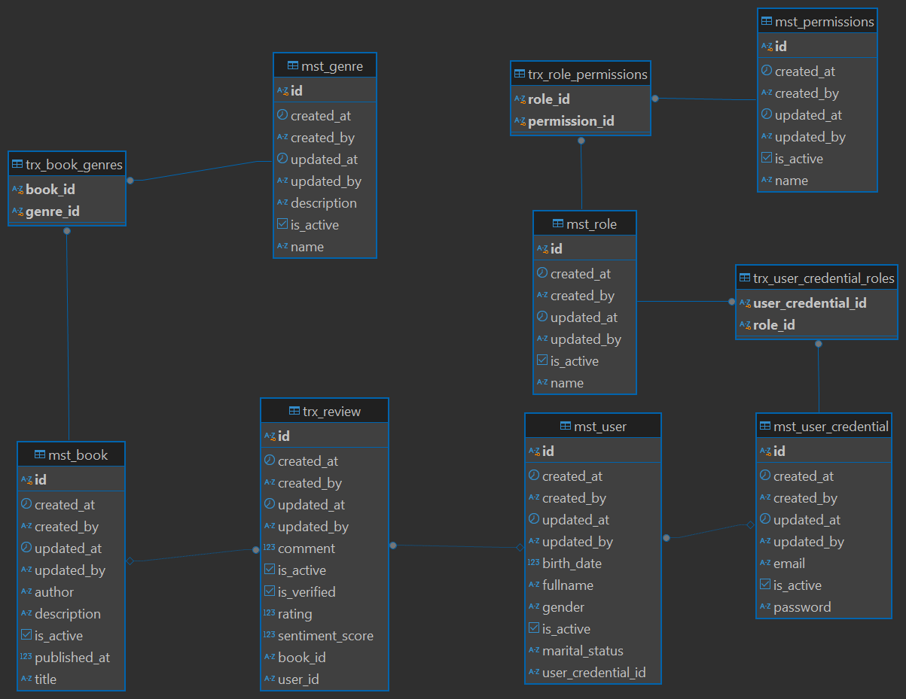

<p align="center">

<h3 align="center">Smartbook API</h3>
</p>
<p align="justify">
Smartbook API is a backend RESTful application designed to facilitate viewing a list of books based on individual user reviews. This API offers a range of features, including but not limited to:
</p>
<ul>
    <li>Authentication and Authorization</li>
    <li>JWT Token with refresh token</li>
    <li>Management Permissions</li>
    <li>Management Roles</li>
    <li>Management User</li>
    <li>Management Genre</li>
    <li>Management Book</li>
    <li>Add review with calculate sentiment score</li>
    <li>Management Review</li>
    <li>Dashboard analytical</li>
</ul>

### Built With

- [Springboot v3.5.3](https://spring.io/)
- [Java 17](https://www.oracle.com/java/technologies/javase/jdk17-archive-downloads.html)
- [PostgreSQL](https://www.postgresql.org/docs/)
- [Maven](https://maven.apache.org/)

### Prerequisites

This is an example of how to list things you need to use the software and how to install them.

- Java IDEA
- PgAdmin or other PostgreSQL DBMS
- Postman or other API Testing Apps<br/>
- Maven Build Tools
- Spring Boot

### Installation

1. Clone the repo
   ```sh
    git clone https://github.com/Myudhaap/spring-smartbook-api
   ```
2. Rename application.properties.example to application.properties and change few config

   ```properties
    spring.application.name=SmartBook
    
    spring.datasource.username=YOUR_USERNAME_DATABASE
    spring.datasource.password=YOUR_PASSWORD_DATABASE
    spring.datasource.url=jdbc:postgresql://localhost:5433/YOUR_NAME_DATABASE
    spring.datasource.driver-class-name=org.postgresql.Driver
    spring.jpa.properties.hibernate.dialect=org.hibernate.dialect.PostgreSQLDialect
    
    spring.jpa.hibernate.ddl-auto=update
    spring.jpa.properties.hibernate.format_sql=true
    spring.jpa.show-sql=true
    
    dev.mayutama.smartbook.jwt.jwt-secret=secret key
    dev.mayutama.smartbook.jwt.app-name=BaseAppSpring
    dev.mayutama.smartbook.jwt.jwt-expired=600
    dev.mayutama.smartbook.jwt.jwt-expired-refresh=20160
    
    spring.profiles.active=default
   ```
3. Install all dependencies and run Maven reload

4. Then run the project on branch development

## API Documentation

Postman : https://documenter.getpostman.com/view/38733465/2sB2xE9nha

### Example Request

- Endpoint : ```/api/v1/reviews```
- Method : POST
- Header :
    - Content-Type: application/json
    - Accept: application/json
    - Authorization: Bearer token 
    - note: If the user accesses via a web browser, session data token and refresh token will be automatically saved in a cookie.
- Body :

```json
{
  "rating": 4,
  "comment": "Test bagus",
  "bookId": "4f0de06c-6660-4c97-9223-f1c901e768ab"
}
```

### Example Response

```json
{
  "statusCode": 201,
  "message": "Success create review",
  "data": {
    "createdAt": "2025-06-24T15:58:02.2175892",
    "updatedAt": "2025-06-24T15:58:02.2175892",
    "createdBy": "user1@test.com",
    "updatedBy": "user1@test.com",
    "id": "b5c70746-a2a2-4e64-8586-27e22357fe82",
    "rating": 4,
    "comment": "Test bagus",
    "isVerified": true,
    "sentimentScore": 0.1,
    "userName": "User 1",
    "book": {
      "createdAt": "2025-06-24T14:04:47.760569",
      "updatedAt": "2025-06-24T14:04:47.760569",
      "createdBy": "user1@test.com",
      "updatedBy": "user1@test.com",
      "id": "4f0de06c-6660-4c97-9223-f1c901e768ab",
      "title": "Mencari jalan 2",
      "author": "Mayutama",
      "description": "Test doang",
      "publishedAt": 12345,
      "genres": [
        {
          "createdAt": "2025-06-24T13:59:59.172848",
          "updatedAt": "2025-06-24T14:02:17.544485",
          "createdBy": "user1@test.com",
          "updatedBy": "user1@test.com",
          "id": "f531605a-d1e5-4853-8179-39db64cee65e",
          "name": "Horror Update",
          "description": "Update"
        }
      ]
    }
  }
}
```

### Entity Relationship Diagram


<!-- CONTACT -->

## Contact

Muhammad Yudha Adi Pratama -
[@Intagram](https://instagram.com/myudha_ap) -
[@Linkedin](https://www.linkedin.com/in/muhammad-yudha-adi-pratama-116433177/)


Project Link Smartbook API: [https://github.com/Myudhaap/spring-smartbook-api](https://github.com/Myudhaap/spring-smartbook-api)
